# Image Background Remover demonstration with Python
This is a simple but fun exercise that was done to demonstrate the power of Python in image manipulation using libraries like Pillow (PIL) and Rembg as well as leveraging ONNX Runtime for faster processing on GPU. 

In this simple but exciting demo, we would see how to leverage the power of Python to remove background from an image file. 
There are two methods that would be explained here.
<br></br>

## METHOD 1: Interactive Python Notebook
You can do this using Jupyter notebook environment. 

This guide uses Google Colab.

Go to [colab.google.com](https://colab.google.com/) 


<br>

Click on New Notebook.

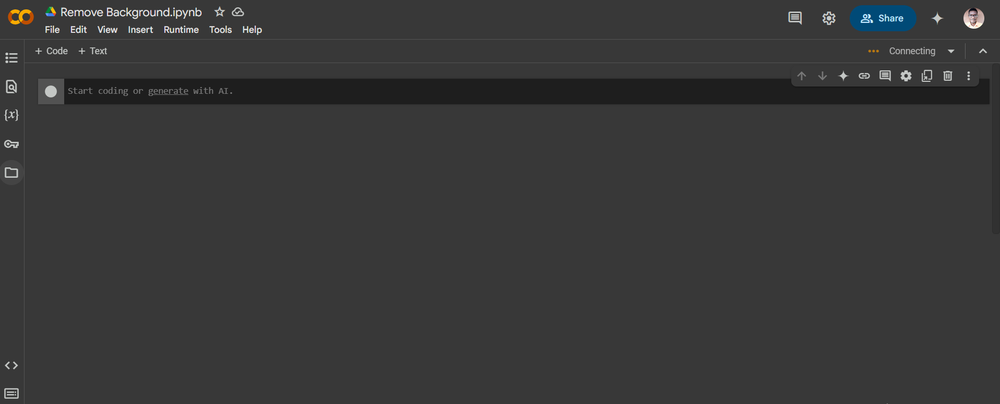
<br>

On the left pane, click on the folder icon to see the Files browser

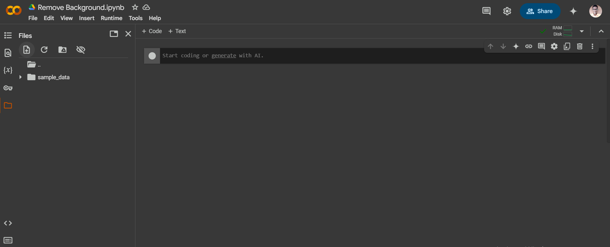
<br>

Click on the file upload icon to upload JPEG photo file(s). 
Browse your local storage to select the file(s) you wish to work on, then click Open and OK.

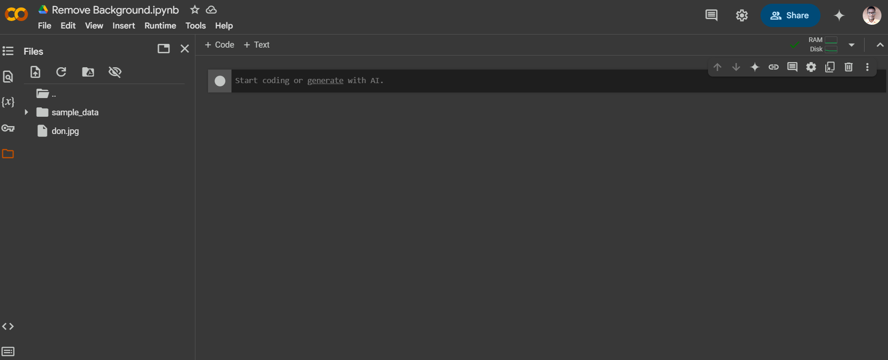
<br>

Double-click on the uploaded image file on the left pane to preview it. 
It displays on the right pane.

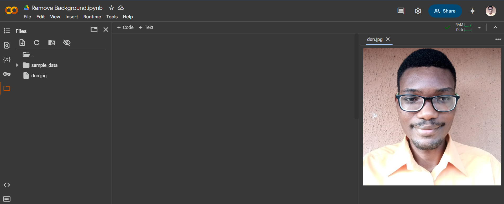
<br>

Now you can just upload the [image_background_remover.ipynb](codes/image_background_remover.ipynb) file provided via File > Upload notebook  > Upload > Browse. This would have all the code ready for you. 

However let’s fill in the code by hand. 
Fill in the code below into three cells, and run each cell one-by-one:
```
pip install pillow rembg onnxruntime

from rembg import remove
from PIL import Image

img = Image.open("photo.jpg")
output = remove(img)
output.save("photo.png")
```

Ensure that a cell has finished running before you run the next one. 
To begin, click on Code just above the middle section. 
After filling in that cell, move your mouse pointer to the middle of the cell and click on the Code icon that appears.

Note that you would have to replace “photo” in the code with the name of the JPEG file you uploaded. 
The output can be of any filename anyway but this file must be a PNG file, while the input should be a JPG file. 

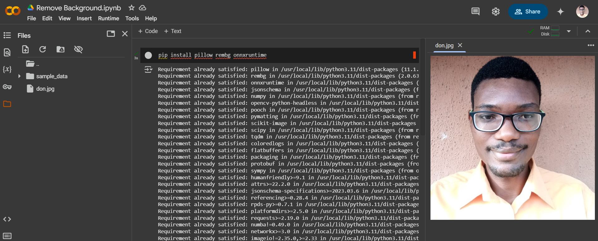
<br>

Be patient for a while so that the third cell would finish running. 
You’ll see that it has finished running when it creates the output image file on the left pane.


<br>

Now double-click on the output file on the left pane to preview it.

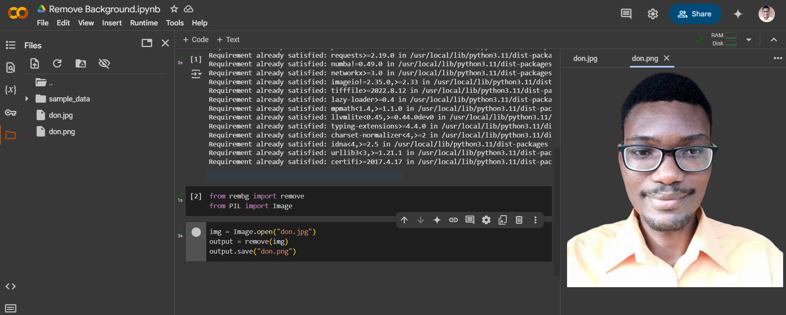
<br>

The background has been removed nicely. 
To download it to your local storage, you can simply right-click on it then click “Save Image As”. 
Alternatively, you can click on the three dots that appear when you point to the output file on the left pane, and then click on “Download”.

To work on another JPEG file, simply upload the file.

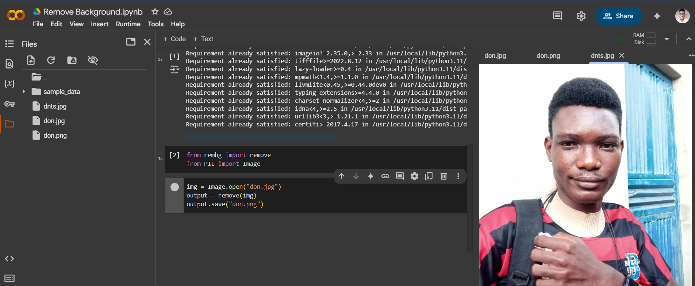
<br>

Then go to the third cell to edit the input and output filenames accordingly, and then re-run only that cell.

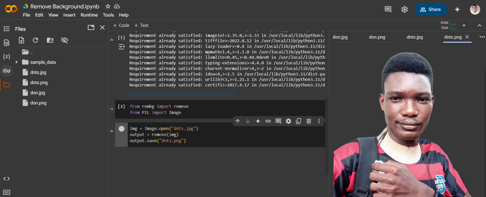
<br>

The background is again, removed!
<br></br>

## METHOD 2: Command-Line Interface (CLI)
This can be done from your command prompt (Windows) or Terminal (Unix/Linux).
Remember to change directory (cd) into the directory that contains the JPEG image file(s) that you want to work on, or you can simply place those files in your current working directory.
Then run this command to install the RemBG CLI package into your environment:
```
pip install rembg[cli] onnxruntime
```

The next command would be used to remove background from a specified JPEG file. 
Replace “photo” with the name of your chosen file. 
The “i” flag is used to pass the file. Again the output file can be of any filename:
```
rembg i photo.jpg photo.png
```

If you want to process multiple JPEG files, pass the directory that contains the files as input using the “p” flag, and specify a directory (the same or another) where the output files would be dumped. 
The code below would be used if the input files are located in your current working and you still want to dump the output files there:
```
rembg p ./ ./
```

In the following examples, the commands would be run on an interactive Python notebook by preceding each command with an exclamation sign “!”:

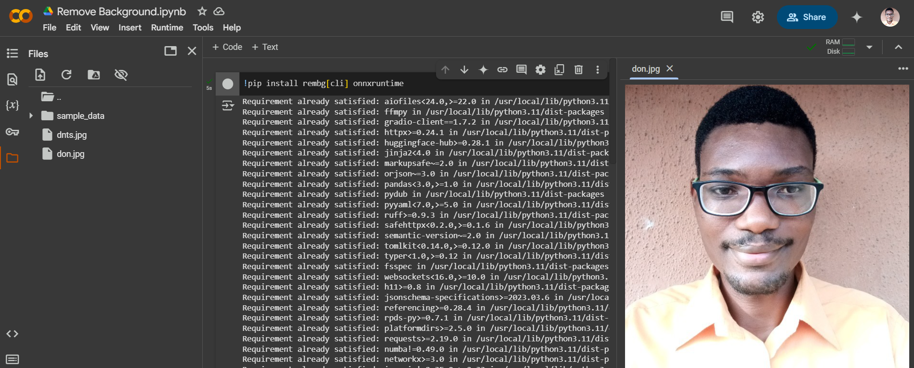

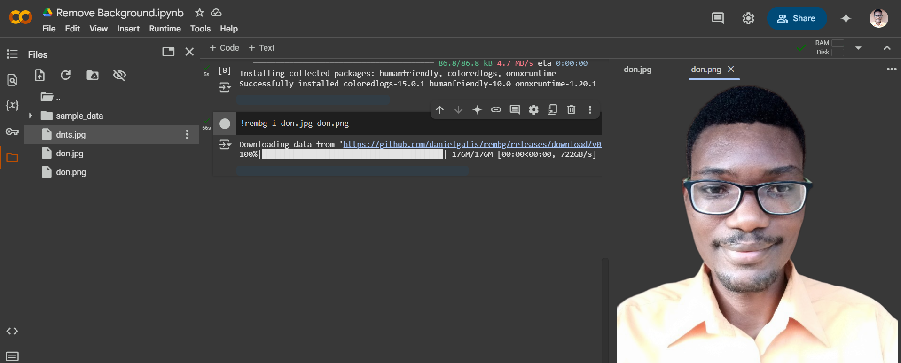

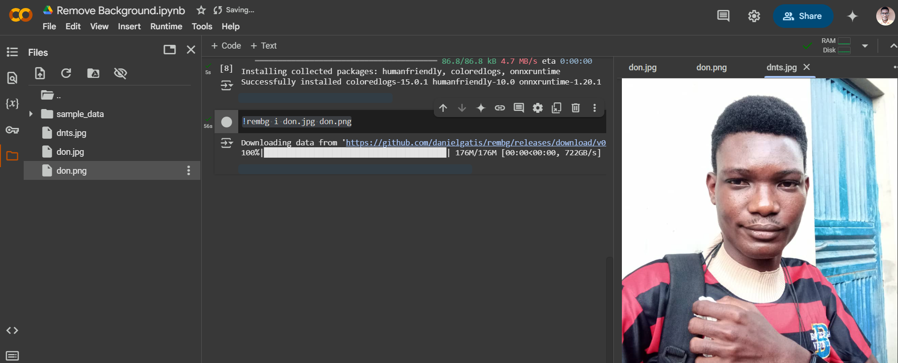

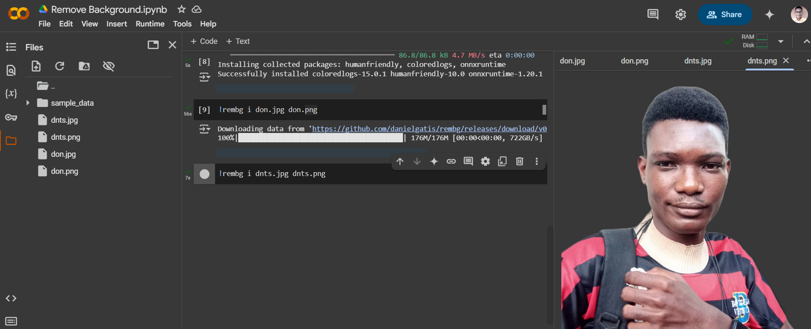
<br>

The following last screenshots show how to handle several files:

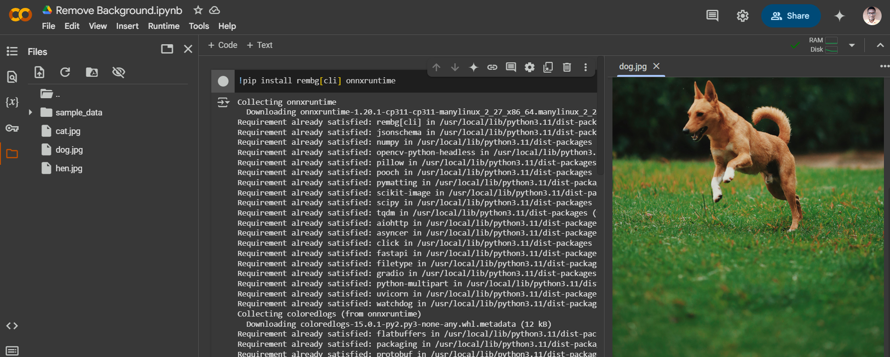

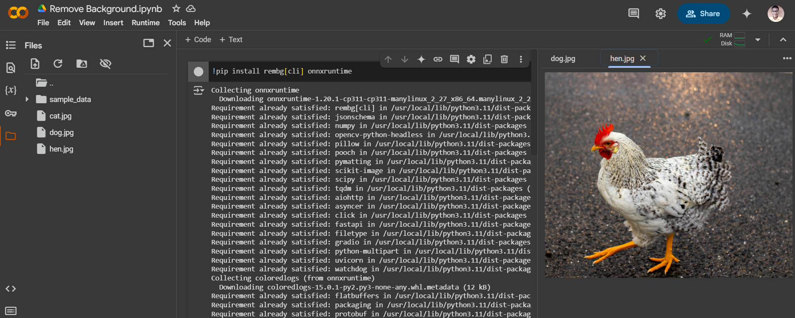

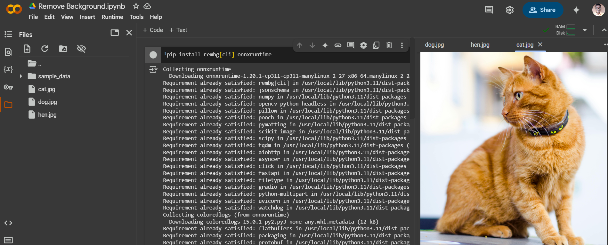
<br>

The outputs:

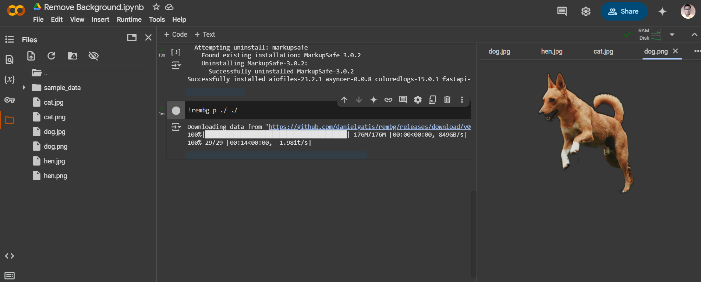

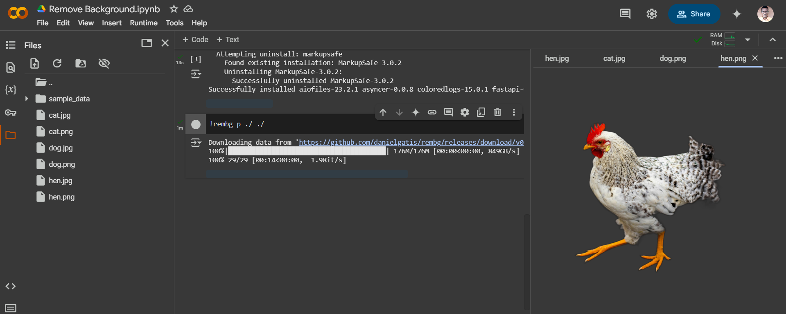

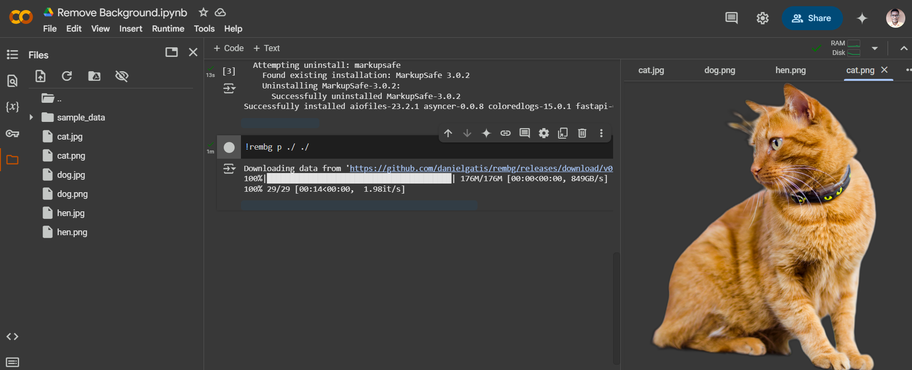
<br>

On a final note, to get faster results you can switch from CPU processing to GPU. Go to the top and click on the Runtime menu, then click Change Runtime Type. Under Hardware Accelerator, click T4 GPU.

NB: The CLI commands are [here.](codes/background_remover_CLI.txt)

You can use the following [photos](photos) to practice (remember to give proper credits if you would share your work online or offline).

IMAGE CREDITS (Pexels.com):
Dog: Matheus Bertelli
Hen: Frank Grün
Cat: Bruno Scramgnon

Thank you for going through this demo with me!
